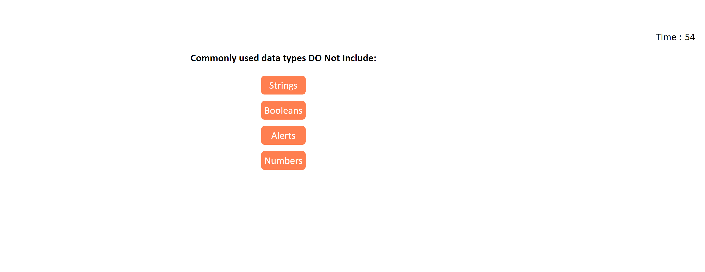
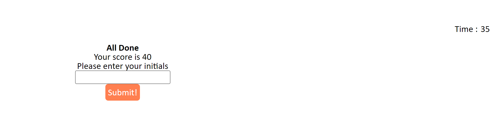
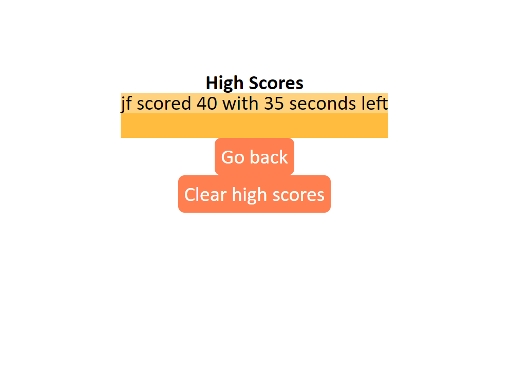

# Coding_quiz

link to live site : https://jbird11801.github.io/Coding_quiz/

## Description

This is a quiz that is dynamic in the fact that if you follow the format you can make any quiz you want. I was really challenged by two aspects in this project.One was event bubbling that cause a issue with the multiple buttons after the inital start button clicked, and the second one was local storage and where I needed to upload it and load it. I overall am really happy with this project.

## Usage

click the start button to start a multiple choce quiz.

set your highscore after the quiz.

follow prompts to view high scores, and clear the or return to the start.

## Credits

Used to make the read me file https://courses.bootcampspot.com/courses/3906/pages/3-dot-5-3-create-a-professional-project-readme?module_item_id=885925

the refrence folder contains the prompt for this project i obtained it from https://git.bootcampcontent.com/University-of-New-Hampshire/UNH-VIRT-FSF-PT-06-2023-U-LOLC

used to remind myself on how to make a curve around my buttons https://www.w3schools.com/css/css3_borders.asp

Used to create a button https://www.w3schools.com/jsref/dom_obj_pushbutton.asp

used to help me debug a issue i had with my elements not showing up https://developer.mozilla.org/en-US/docs/Web/API/Document/getElementById

used to help hide elements https://www.w3schools.com/css/css_display_visibility.asp

How i used a loacal storage arrayhttps://stackoverflow.com/questions/3357553/how-do-i-store-an-array-in-localstorage

My tearcher help me with event bubbling 

## License

Please refrence license file

